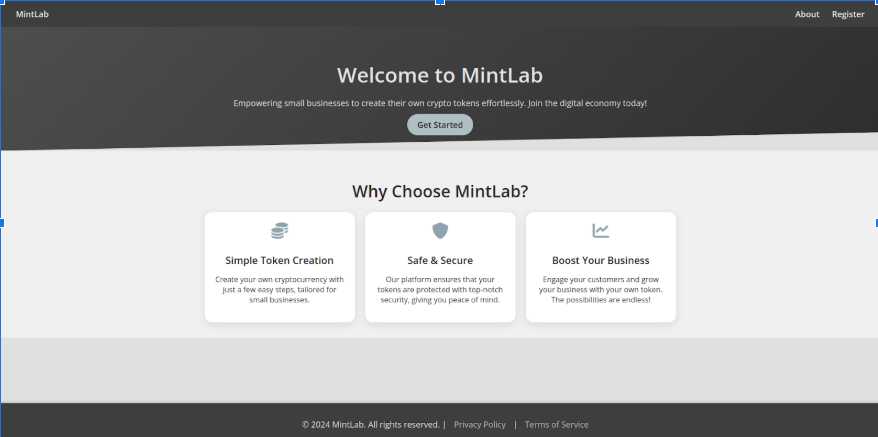
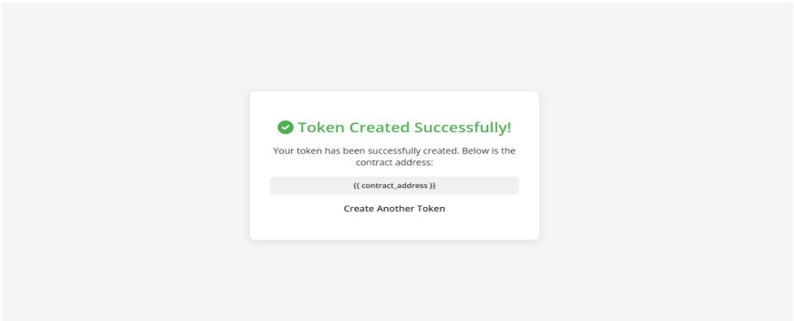

# 🚀 MintLap Project

This project is a Django-based application that allows users to create their own test tokens through a web interface. Using the Web3.py library and Infura API, the token creation process is executed on the **Sepolia Testnet**. The hash address of the created token is displayed to the user and can be tracked on Etherscan.

---



## 📌 Features

- **Token Creation:** Users can create their own tokens by entering the token name, symbol, total supply, and other details.
- **Blockchain Integration:** Web3.py and Infura are used to execute token creation on the **Sepolia Testnet**.
- **Hash Address:** The transaction hash address of the created token is displayed to the user.
- **Etherscan Integration:** The hash address can be tracked on Etherscan to view transactions related to the token.
  

---

## 🛠️ Technologies

- **Backend:** Django
- **Blockchain Operations:** Web3.py
- **Ethereum Connection:** Infura API (Sepolia Testnet)
- **Frontend:** HTML, CSS

---

## 🚀 Installation and Setup

To run the project on your local machine, follow these steps:

### 1. Prerequisites
- Python 3.8 or higher
- Pip (Python package manager)
- Git

### 2. Clone the Project
```bash
git clone https://github.com/aybikedalbul/MintLab.git
cd token-creator-project
```

### 3. Create a Virtual Environment and Install Requirements
```bash
python -m venv venv
source venv/bin/activate  # For Windows: venv\Scripts\activate
pip install -r requirements.txt
```

### 4. Set Up Environment Variables
The project requires sensitive information such as the Infura API key and Ethereum wallet details. Add these to a `.env` file:
```env
INFURA_PROJECT_ID= **********
WALLET_PRIVATE_KEY= *********
NETWORK=sepolia  
```

### 5. Database Migrations
```bash
python manage.py migrate
```

### 6. Run the Server
```bash
python manage.py runserver
```
Then, open your browser and navigate to `http://127.0.0.1:8000/` to start using the project.

---


## 🖥️ Usage

1. **Enter Token Details:**
   - Enter the token name, symbol, total supply, and other required details in the web interface.
   
2. **Create Token:**
   - Click the "Create Token" button to initiate the process.
   
3. **Get Hash Address:**
   - Once the transaction is complete, the token's transaction hash address will be displayed on the screen.
   
4. **Track on Etherscan:**
   - Enter the hash address on [Etherscan for Sepolia](https://sepolia.etherscan.io/) to view transactions related to the token.


---



## 🤝 Contributing

This project is open-source. If you'd like to contribute:
1. Fork the repository.
2. Create a new branch (`git checkout -b new-feature`).
3. Commit your changes (`git commit -m 'Add new feature'`).
4. Push the branch (`git push origin new-feature`).
5. Open a pull request.

---

## 📜 License

This project is licensed under the [MIT License](LICENSE).

---

## 📞 Contact

For questions or feedback about the project:
- **Email:** aybikedalbul79@gmail.com
- **LinkedIn:** https://www.linkedin.com/in/aybikedalbul/

---
